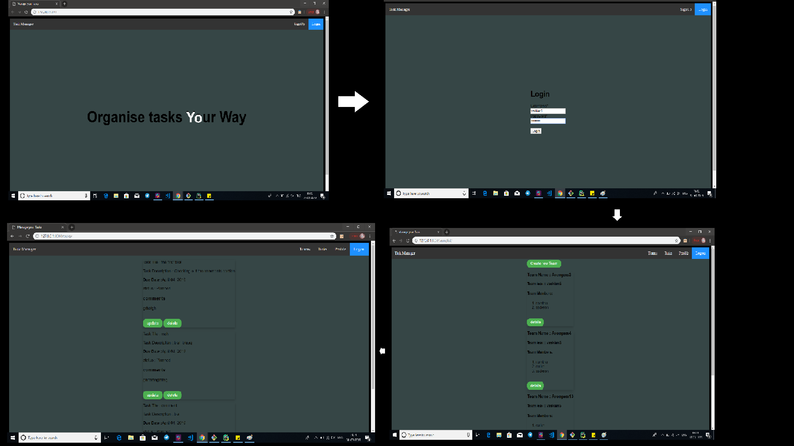
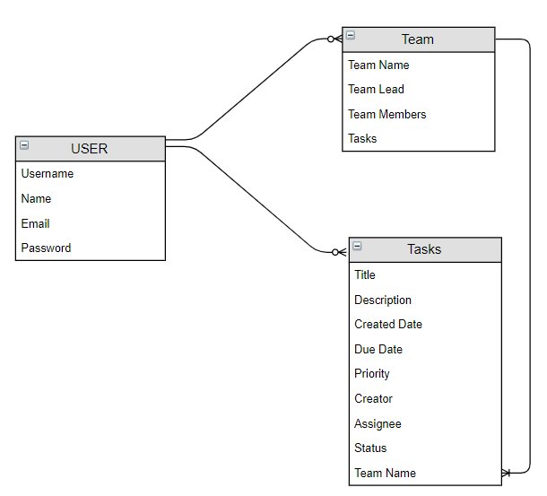

## fsf_2019_screening_task1
# Task-Manager Django App
# Description:
Django Web Application for managing Tasks and Team works.

# Running the application locally:
The required modules and plugins are specified in the 'requirements.txt' file.
After installation move to the base directory and run the following commands,
```
python manage.py makemigrations
python manage.py migrate
python manage.py runserver

```
# Website Specifications:
- Backend :Django
- frontend : HTML,CSS
- IDE used : PyCharm

# Features:
- Create Tasks
- Comment on your tasks
- Set priorities for your tasks
- Create Team
- Assign tasks with due date to team members


# WireFrame and Steps:(How it Works)



# Database Structure:




# Functionalities:
- User:
  - Create To-do lists
  - update
  - delete
  - Create Teams

- Team Lead:
  - Add team Members
  - Assign Tasks
  - delete and update tasks

- Team Members:
  - view tasks by them and their leads
  - comment on their own tasks and that of their team leads


# Project Creator:

<p align="center"> Made with ❤ by <a href="https://github.com/Nami2012">Namitha S</a></p>


